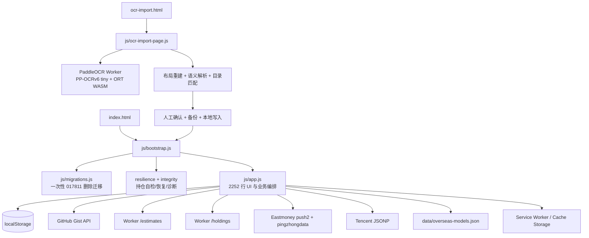

# 蜉蝣基金 v15.0.0 Phase 0 审计

> 审计日期：2026-08-25（Asia/Shanghai）
> 审计基线：`main` / `fc71555409e5bb3d86cbc3e0225d3850a127d590`
> 审计时版本：`14.0.2`
> 审计结论：`CONDITIONALLY_TRUSTED / V15_NOT_READY`
> 本阶段边界：只新增本审计文档；未修改功能、版本、持仓或远端 Gist，未推送、未发布。
>
> 说明：第 1—17 节保留 2026-08-25 的 Phase 0 基线事实；后续实现进度与最新证据见第 18 节，不能用基线中的“未实现”描述覆盖后续验证结果。

## 1. 执行摘要

v14.0.2 已具备可继续演进的可靠基础：本地持仓完整性检查、两级备份、Gist 双向合并、行情来源时间展示、正式净值与模型估算区分、OCR 独立页面、OCR 资产按需加载、Service Worker 离线壳，以及 123 项自动测试。

但它还不是 v15 所定义的“可信估值内核”。当前主要问题不是某一个接口，而是同一基金的主源、备源、正式净值、重仓模型、海外模型和缓存仍以不同字段散落在 `app.js` 中。UI、排序、缓存和诊断并未消费同一个 Quote Envelope；刷新触发虽被串行化，却没有真正的 generation 写入门禁、主动取消或源健康状态；Gist 能读取高版本结构，却固定回写 Schema 2；OCR 只有 WASM 主路径，没有 WebGPU 尝试、WASM 自动回退、完整资产清单或非敏感性能账本。

因此建议按方案的六个阶段渐进改造，不做框架迁移，也不一次性重写 `app.js`。Phase 1—4 可以先在本地完成并逐阶段验证；Phase 5 只先提交局部 UI 原型；Phase 6 必须补齐 Android/已安装 PWA 等实机证据后，才允许统一改为 15.0.0。

## 2. 仓库与发布基线

| 项目 | 当前事实 |
|---|---|
| 分支与远端 | `main` 与 `origin/main` 同为 `fc71555`，审计开始时工作区干净、领先/落后均为 0 |
| 远端 | `https://github.com/AureliusWu/FundVal.git` |
| 版本源 | `package.json`、`js/version.js`、`sw.js`、manifest、README、AGENTS 均为 14.0.2 |
| 应用形态 | 零框架静态 PWA；ES modules；GitHub Pages |
| 部署触发 | `main` push、PR、手动 workflow dispatch |
| CI | Node 24；锁定依赖安装；高危依赖审计；测试；语法检查；构建；产物检查；Pages 部署与 OCR 资源 HEAD smoke |
| 当前版本门槛 | 自动门槛通过；Android Chrome、Android 已安装 PWA、iOS Safari 的真实 OCR/更新流程没有本轮实机证据 |

## 3. 真实架构



### 3.1 启动顺序

1. `bootstrap.js` 动态导入 `migrations.js`。
2. 运行启动完整性检查并安装运行时错误、storage、online/offline 守卫。
3. 动态导入 `app.js`。
4. `app.js` 读取持仓，先显示绑定持仓指纹的本地行情缓存。
5. 立即启动 startup 刷新；海外模型配置加载后再启动第二轮刷新。
6. 启动行情定时器、指数定时器、通知、Gist 启动拉取和每分钟自动拉取。

风险：`migrations.js` 不是通用迁移框架，而是会在页面加载时为单一基金写 tombstone、清缓存，并在有 Token 时异步修改 Gist 的一次性脚本。Schema 3 不能沿用这种“模块加载即迁移远端”的模式。

## 4. 当前数据链路

| 数据 | 当前源与顺序 | 当前适配结果 | 主要边界 |
|---|---|---|---|
| 基金主列表估值 | Cloudflare Worker `/estimates` | `eastmoney-estimate.js` 转成旧式基金对象 | Adapter 丢弃响应级 accounting、diagnostics、reason code，并把多种上游状态压成 `status: ok` |
| 正式净值 | Eastmoney `pingzhongdata/{code}.js` | 最近两期净值、日期、涨跌和部分基金元数据 | JSONP 全局变量必须串行；无调用方 AbortSignal |
| 直接备选 | Eastmoney push2 `stock/get?secid=0.{fundCode}` | `last_nav`、昨日涨跌、涨跌额 | 基金代码被当作证券 secid，能力定义含糊，必须降为明确的 secondary 并校验资产身份 |
| 十大重仓 | Worker `/holdings` | 披露日期、拉取时间、最多十项 | 主列表刷新会为每只基金预取重仓估值链路，详情与估值职责耦合 |
| 重仓穿透估算 | 披露重仓 + Eastmoney/Tencent 当日证券行情 | 覆盖率至少 50%、至少 5 个当日行情才可用 | 结果写回旧字段，reason/coverage 未统一进入排序与诊断契约 |
| 海外模型 | 本地 `overseas-models.json` + Tencent/黄金行情 | 加权涨跌、可用权重、模型版本、置信度 | 36 小时固定窗口；市场统一性不足；模型对象再写入旧基金对象 |
| 指数 | Tencent JSONP + 黄金多 secid | 页面顶部独立 `indexCache` | 不经过基金 Quote Contract；状态和时钟另算 |
| 基金详情 | Worker holdings + Eastmoney 元数据/费率 | 展开时加载 | 内存缓存，没有统一源健康或 generation |
| 持仓云同步 | GitHub Gist API | Schema 1/2/更高版本读取，按 code + updated_at 合并 | 读取时丢弃远端 schema 元数据；写回固定 Schema 2；PATCH 后不读回验证 |

### 4.1 2026-08-25 在线抽样

在北京时间约 12:13 对公开 Worker 做了五轮只读抽样，不包含用户持仓：

| 端点 | HTTP | 五轮中位数 | 首轮 | 语义结果 |
|---|---:|---:|---:|---|
| `/estimates?codes=005844,012920,539002` | 200 | 232 ms | 5120 ms | 响应整体为 `degraded`，3/3 均为 `official_nav`，没有盘中主源或模型结果 |
| `/holdings?code=005844` | 200 | 232 ms | 3849 ms | 返回披露重仓，后续热请求约 205—244 ms |

抽样说明：Worker 原始响应已经明确给出 `kind`、`source`、`is_fallback`、`source_time`、coverage、note 和 diagnostics。前端 Adapter 只保留其中一部分，所以 v15 应优先修复“语义信息在前端丢失”，而不是把请求完成时间伪装成行情时间。首轮数秒级延迟也说明刷新协调器需要超时、部分成功和源健康，不应让单源冷启动阻塞整轮可用结果。

## 5. 当前状态对象

### 5.1 本地持仓

```js
{
  code,
  name,
  shares,
  cost,
  updated_at,
  deleted
}
```

实际主键是 `code`。没有稳定 `id`、`revision`、记录级 `deviceId`、`createdAt`、`deletedAt`。`shares` 与 `cost` 的合法 0 会被保留，但部分 UI 构造仍使用 `value || 0`，会把缺失和 0 混在显示层。

### 5.2 行情与估值

`fundsData` 同时承载：

- 原始 Adapter 字段：`last_nav`、`est_nav`、`est_change`、`est_time`、`est_kind`；
- 正式净值：`latest_nav_move`；
- 海外/重仓模型：`est_model_*`、`est_holdings_model`、coverage、confidence；
- 持仓计算：`curr_value`、`today_profit`、`total_profit`；
- UI 临时状态：`loading`、`stale`、`error`、`_cached`；
- 二次选择结果：`primary_change`、`primary_nav`、`display`、`freshness`。

这不是统一契约，而是不断扩展的联合对象。`preferredDailyMove`、`chooseDisplayValue`、`buildFreshness`、`displayChangeOf` 和渲染函数都会再次判断来源语义，造成同一规则多处实现。

### 5.3 当前 freshness

当前对象为：

```js
{
  sourceTime,
  fetchedAt,
  calculatedAt,
  ageSeconds,
  status,
  source,
  isFallback,
  fallbackReason,
  label,
  market,
  sourceTimeInFuture
}
```

状态使用 `fresh/degraded/delayed/stale/unavailable`，与 v15 Quote Envelope 的 `realtime/delayed/stale/model/official/unavailable` 不一致。只有带分钟的来源时间才计算 age；仅日期的正式净值不会冒充分钟，这是正确边界。市场关闭会把本来新鲜的行情标成 delayed，市场状态与数据新鲜度仍被混为一个判断。

## 6. 当前缓存链路

| 层级 | Key/范围 | TTL/策略 | 可信性现状 |
|---|---|---|---|
| 主列表本地缓存 | `fuyu_funds_cache_v1` | 60 秒；绑定 holdingsHash | 能显示旧值并标缓存，但保存的是混合 `fundsData`，不是 Quote Envelope |
| 正式净值 | `fuyu_nav_move_{code}` | 10 分钟 | 有 fetchedAt/expiresAt/source；没有 observedAt/valueKind/reasonCodes |
| 黄金 | `fuyu_gold_cache_v2` | 2 分钟 | 独立结构与回退逻辑 |
| 重仓/详情 | 内存对象与 Promise Map | 重仓 12 小时；元数据 7 天 | 页面重载丢失；无 generation/source health |
| 海外模型配置 | SW + HTTP | SW stale-while-revalidate | 配置本身有版本/季度，但与 Quote 缓存未统一 |
| OCR 基金目录 | HTTP/Service Worker 路由 | 当前 `.json` 命中 cache-first | 与方案要求的带版本 SWR 不一致 |
| App Shell | `fuyu-v14.0.2` Cache Storage | install 时 CORE 预缓存 | OCR 资产未进入 CORE，符合隐私与容量边界 |
| OCR 大资产 | 浏览器 HTTP 缓存 | SW network-only | 首屏不请求，不在 Cache Storage 复制，符合当前要求 |

通用缓存只保存 `fetchedAt` 与 `expiresAt`。它无法证明行情的 `observedAt`，因此不能单独判断数据是否实时。

## 7. 当前刷新链路

```text
trigger
  -> refreshRequestId++
  -> append to refreshChain
  -> snapshot current holdings
  -> batch estimate request
  -> optional overseas quote request
  -> one holdings-estimate request per fund
  -> per-fund official/fallback fetch
  -> per-fund build + immediate UI write + immediate cache write
  -> Promise.allSettled
  -> only latest request updates top summary
```

触发源包括 startup、模型加载完成、timer、下拉刷新、visibility、online、14:30 通知前刷新、Gist 拉取后刷新和 OCR 返回。

### 已有优点

- `refreshChain` 避免两轮刷新同时执行共享 JSONP 全局变量。
- 单基金任务使用 `Promise.allSettled`，失败不会清空其他基金。
- 失败基金保留旧对象并标 stale/unavailable。
- Tencent JSONP 与 Eastmoney `Data_netWorthTrend` 各自串行，避免全局变量串写。

### 关键缺口

1. 新触发只增加 `refreshRequestId`，旧轮次仍会在每只基金完成时直接 `upsertFundData`、render 和 `saveCache`；只有最终顶部摘要检查 requestId。
2. 串行链会让无意义旧轮次完整跑完，新轮次只能排队，连续 visibility/online/manual 会形成积压。
3. Adapter 自建 AbortController，调用方不能统一取消；JSONP 也没有 generation 结果门禁。
4. abort、timeout、上游 5xx、数据无效目前没有统一错误分类；也没有 source health 或 circuit breaker。
5. 主列表刷新预先为每只基金拉取重仓链路，详情/模型请求可能增加首轮完成时间。
6. 现有 refresh 测试主要检查源码中是否存在强制刷新触发和 `refreshChain` 文本，不会构造旧请求晚返回覆盖、取消、部分成功或队列风暴。

结论：当前实现“物理串行”，但不满足“只有当前 generation 可以写当前状态”的 v15 语义。

## 8. 当前持仓与 Gist Schema

### 8.1 本地

- `fuyu_holdings_v1` 保存记录数组，不带 schema wrapper。
- 完整性层按 code 去重，较新 `updated_at` 胜出；相同时间 tombstone 优先。
- 主备份为 `fuyu_backup_latest` 与 `fuyu_backup_previous`。
- 语义损坏会尝试从备份恢复；无有效备份时保留原始损坏值，不擅自改成 0。

### 8.2 云端

当前写出结构：

```js
{
  schema: 2,
  updated_at,
  device_id,
  holdings: []
}
```

### 8.3 P0 迁移风险

- `parseCloudPayload` 接受 `schema >= 2`，但 `readCloudHoldings` 只返回 holdings，调用层丢失远端 schema。
- `makeCloudPayload` 无条件输出 Schema 2。若未来设备写入 Schema 3，当前设备读取后再 push 会把远端降写，并丢失 v3 字段。
- push 执行 GET -> merge -> PATCH，但 PATCH 前没有强制新备份，PATCH 后没有 GET/readback 验证。
- `isSyncing` 冲突时直接 return，调用者拿不到明确成功/失败状态；UI 同步成功语义需要继续审计与收口。
- 现有一次性迁移会在 load 事件自动 PATCH Gist，不适合作为通用、可回滚、可观察的迁移执行器。

Schema 3 写回建议：先实现纯函数读/迁移/合并与本地备份；默认仍不触碰真实 Gist。只有在能证明旧数组、Schema 2、Schema 3 双向兼容、禁止高版本降写、PATCH 后读回一致且用户明确允许后，才迁移真实远端。

## 9. 当前 OCR 链路

```text
File/Blob only
 -> MIME/后缀/文件头校验
 -> createImageBitmap 整图解码
 -> 顶部来源区域 + 持仓区域纵向分片
 -> 懒加载同源 PaddleOCR Worker
 -> PP-OCRv6 tiny + ORT single-thread WASM
 -> positioned tokens only
 -> 三列布局重建
 -> 支付宝来源证据 + 目录匹配
 -> import plan
 -> 人工确认真实份额
 -> 两级备份
 -> 本地事务式写入
 -> 返回主页面刷新并按既有设置同步 Gist
```

### 已有正确边界

- OCR 页面与主行情页面隔离，CSP 为同源且不加载第三方行情。
- 只接受本地 Blob；拒绝 URL/Base64；校验实际图片头。
- 单 Worker、单任务锁、单线程 WASM；长截图按纵向重叠分片。
- 不构造持久 OCR transcript；候选生成后主动清空 tokens。
- 未人工确认、缺少真实份额或安全读取失败时不写持仓。
- OCR 大资产首屏 0 静态依赖、0 CORE 预缓存。

### v15 缺口

- 当前实际入口只调用 Paddle；`local-ocr.js` 的 Tesseract 实现存在但不是失败回退。
- ORT 后端固定为 WASM；没有 Worker 内 WebGPU capability probe、一次尝试与失败后稳定回退。
- `createPaddleOcrOptions` 与构建后实际 Worker 初始化配置是两套定义，前者主要被测试读取，存在测试与生产配置漂移风险。
- 现有 `integrity.json` 只覆盖两个模型的 bytes/hash，不是包含引擎、ORT、所有资产、版本与生成时间的完整 asset manifest。
- 没有只含设备能力、图片尺寸、分片数、阶段耗时、后端、回退和错误类别的 performance ledger。
- 自动测试覆盖图片校验、分片、布局与隐私静态边界，但没有真实引擎推理、真实长截图耗时、Android 内存、WebGPU -> WASM 回退或已安装 PWA 文件选择证据。

## 10. 当前 Service Worker

| 资源 | v14.0.2 实际策略 | 与 v15 目标 |
|---|---|---|
| CORE App Shell | install `cache.addAll`；版本缓存 | 基本符合；仍需更新失败恢复测试 |
| HTML/navigation | network-first，离线回 index | 符合 |
| JS/CSS | network-first | 目标为 SWR 或 hashed asset |
| overseas models | stale-while-revalidate | 符合方向 |
| manifest | 因 `.json` 规则为 cache-first | 不符合 network-first |
| fund catalog | `.json` cache-first | 不符合 versioned SWR |
| OCR 资产 | network-only | 符合；避免 Cache Storage 双份占用 |
| 外部行情/API | SW 不拦截跨域 | 符合 network-only 边界 |

已有更新提示：新 SW installed 后显示 toast，用户点击才发送 `SKIP_WAITING`，`controllerchange` 后 reload。缺口是点击更新前没有让 RefreshCoordinator 停止、没有编辑持仓 dirty-state 守卫，也没有端到端更新握手测试。

## 11. 自动化与测试缺口

### 当前基线结果

| 门槛 | 结果 |
|---|---|
| `npm ci` | 通过；55 个包；0 vulnerability |
| `npm test` | 123/123 通过；约 1.92 秒命令耗时 |
| `npm run check` | 通过；约 2.71 秒 |
| `npm audit --audit-level=high` | 通过；0 vulnerability |
| `npm run build` | 连续 3 次通过；中位数约 1.01 秒 |

### 必须补齐的测试

1. Quote Contract：所有 value kind、0/null、时间精度、future skew、reason code、缓存 round-trip。
2. RefreshCoordinator：乱序完成、generation 失效、abort 不算故障、重复触发折叠、单基金失败、部分成功、timeout、队列上限。
3. Source health：连续失败、cooldown、half-open、成功恢复、不同源隔离。
4. Market Session：CN/HK/US/JP/KR/Gold/QDII/Unknown，盘前、午休、收盘、周末、节假日占位与 nextRefreshAt。
5. Schema 3：旧数组/2/3、幂等迁移、稳定 id、revision 冲突、tombstone、高版本禁止降写、备份、失败回滚、PATCH readback。
6. OCR：WebGPU 初始化成功、初始化失败一次性回 WASM、WASM 直接路径、asset manifest 全量 hash、performance ledger 脱敏与上限。
7. SW：manifest network-first、catalog versioned SWR、更新握手、刷新停止、编辑保护、离线旧行情状态。
8. 浏览器/实机：真实长截图 cold/warm、Android Chrome、Android PWA、iOS Safari、断网恢复、前后台与多轮自动刷新。

## 12. 性能基线

### 12.1 构建产物

| 指标 | 当前值 |
|---|---:|
| 文件数 | 56 |
| 总产物 | 91,815,649 bytes |
| OCR 资产 | 88,185,570 bytes（约 96.0%） |
| 非 OCR | 3,630,079 bytes |
| 基金目录 | 2,822,600 bytes |
| `app.js` | 95,686 bytes / 2252 行 |
| 最大单文件 | ORT WebGPU/JSEP WASM 26,827,543 bytes |

静态依赖与 SW CORE 检查确认：首页没有 OCR 模块或 OCR asset URL，未进入 OCR 页时不会初始化 Worker。当前大体积本身不是首屏回归，但完整构建复制了多套 ORT WASM 变体，v15 asset manifest 应明确“会被哪种后端实际请求”，避免把“产物存在”误当作“首屏传输”。

### 12.2 尚未形成的真实性能证据

- 没有浏览器 PerformanceResourceTiming 证明首页 OCR 请求数为 0；当前只有源码与构建静态证据。
- 没有真实长截图的 cold init、warm init、preprocess、detection、recognition、layout、parse、total 分段数据。
- 没有 Android 内存峰值、Worker 崩溃率或 WebGPU/WASM 实测。

这些项目在 Phase 4 与 Phase 6 前保持 `NOT_RUN`，不得用桌面单元测试替代。

## 13. 与 v15 方案冲突的现实代码点

| 方案要求 | 当前现实 | 处理建议 |
|---|---|---|
| 所有来源进入 Quote Envelope | `fundsData` 是原始、派生和 UI 状态混合对象 | Phase 1 先加契约与 Adapter，不立即重写 UI |
| 只有最新 generation 可写 | 只有顶部摘要检查 requestId | Phase 2 在所有 store/cache/UI commit 前统一 gate |
| 主动 abort | Adapter 内部自建 controller，JSONP 无调用方 gate | 传入 signal；JSONP 结果用 generation 丢弃 |
| source health/circuit breaker | 无统一状态 | 声明式 registry + 内存健康表 +脱敏诊断 |
| 市场 Registry | freshness 仅 cn/cn-index/hk/gold/overseas，海外主要按 US | 新模块覆盖 JP/KR/QDII/Unknown |
| 排序按有效等级 | 只粗略排除 stale/unavailable，再按旧字段 | 消费 Quote status rank，稳定 tie-break |
| Schema 3 与禁止降写 | 能读高版本但固定写 Schema 2 | Phase 3 先 fail-closed，再迁移；真实 Gist 暂不改 |
| WebGPU -> WASM | 生产 Worker 固定 WASM | Phase 4 Worker 内一次 probe + fallback |
| 完整 OCR manifest/ledger | 只有模型 integrity.json | 构建生成完整 manifest；本地有限、脱敏 ledger |
| manifest network-first/catalog SWR | 两者当前 cache-first | Phase 6 调整并加 SW 测试 |
| UI 大改先原型 | 当前还未开始 | Phase 5 只做局部 prototype，等待用户确认 |

## 14. 风险排序

### P0 — v15 发布阻断

1. **高版本 Gist 可被降写。** 读取时接受 Schema 3，写回却固定 Schema 2，存在跨版本字段丢失风险。
2. **没有可验证的 Schema 3 迁移事务。** 当前一次性迁移会自动触碰远端，且 push 无 readback；不能直接用于用户真实数据。
3. **实机门槛缺失。** Android/PWA OCR 与 SW 更新没有本轮真实设备证据，按方案不能改最终版本号或发布。

### P1 — 核心可信性

1. Quote 语义分散，Worker 已提供的 reason/coverage/diagnostics 在 Adapter 层丢失。
2. 刷新没有 generation 写入门禁、主动取消、触发折叠和 source health。
3. 排序与 UI 仍自行推断数据等级，无法保证旧值永远与实时项分层。
4. 主列表刷新预取重仓估值，可能被非必要详情链路拖慢。
5. OCR 没有 WebGPU 尝试、稳定 WASM 自动回退和真实长截图性能账本。

### P2 — 可维护性与体验

1. `app.js` 2252 行，云同步、行情、估值、排序、渲染、通知和 SW 更新集中在一个模块。
2. market session 不完整，节假日与 QDII 语义不够精确。
3. manifest/catalog 的 SW 策略与目标不一致。
4. 诊断中心缺少 schema、source health、market state、OCR capability 和完整刷新摘要。
5. 首页仍加载第三方 Google Fonts；不影响 OCR 隐私，但应纳入离线与性能评估。

## 15. 建议修改文件清单

### Phase 1 — Quote Contract

- 新增 `js/runtime/quote-contract.js`
- 新增 `js/runtime/quote-normalizer.js`
- 新增 `js/runtime/market-session.js`
- 新增 `js/runtime/source-registry.js`
- 修改 `js/eastmoney-estimate.js`
- 修改 `js/fund-holdings.js`
- 修改 `js/freshness.js`
- 修改 `js/calculator.js`
- 最小接入 `js/app.js`
- 新增对应 `test/*` 单元测试

### Phase 2 — Refresh Runtime

- 新增 `js/runtime/refresh-generation.js`
- 新增 `js/runtime/refresh-coordinator.js`
- 新增 `js/runtime/source-health.js`
- 修改各 Adapter 以接收调用方 signal/context
- 从 `js/app.js` 抽出刷新提交边界
- 新增乱序、abort、partial success、cooldown 测试

### Phase 3 — Storage Schema 3

- 新增 `js/storage/holdings-schema.js`
- 新增 `js/storage/holdings-migration.js`
- 新增 `js/storage/cloud-sync.js`
- 修改 `js/storage.js`、`js/integrity.js`、`js/resilience.js`
- 将 `js/migrations.js` 收口为显式、幂等迁移注册器
- 修改 OCR 确认写入以使用同一事务接口
- 新增兼容、冲突、备份、回滚、禁止降写与 readback 测试

### Phase 4 — OCR 2.0

- 新增 `js/ocr/ocr-capabilities.js`
- 新增 `js/ocr/ocr-performance.js`
- 修改 `scripts/paddle-ocr-entry.mjs`
- 修改 `scripts/build-paddle-ocr.mjs`
- 修改 `js/paddle-local-ocr.js` 与 `js/ocr-import-page.js`
- 构建生成 `assets/ocr/manifest.json`
- 新增 backend fallback、manifest、ledger 与隐私测试

### Phase 5 — UI prototype

- 新增局部 prototype（放在 `docs/v15/` 或测试夹具，不替换生产 UI）
- 用户确认后再修改 `index.html`、`css/style.css` 与基金卡片渲染

### Phase 6 — PWA / Release Gate

- 修改 `sw.js`、`manifest.json`、更新握手与部署验证
- 补齐浏览器、离线、Android/PWA/iOS 验证记录
- 所有门槛完成后才统一修改版本源、README、AGENTS、CHANGELOG

## 16. 阶段与回滚点

| 阶段 | 完成门槛 | 回滚点 |
|---|---|---|
| 0 审计 | 本文、基线测试与风险清单 | 删除本文即可；无功能变化 |
| 1 Quote | Contract/normalizer/market tests + 全量回归 | 旧 Adapter 输出保留一层兼容映射，可整阶段撤回 |
| 2 Refresh | 乱序/abort/partial/circuit tests + 全量回归 | 通过 feature switch 回旧串行 refresh，保持新 Contract 不变 |
| 3 Schema | 纯函数迁移、备份、幂等、禁止降写、readback 测试 | 保留迁移前备份；真实 Gist 未授权前不执行写迁移 |
| 4 OCR | WASM 路径不回归；WebGPU 失败必回退；manifest/ledger 脱敏 | capability switch 强制 WASM；旧 OCR 解析与确认链不变 |
| 5 UI | 先提供局部 prototype，经用户确认 | prototype 独立，不影响生产 UI |
| 6 Release | CI、SW、离线、真实设备矩阵全部通过 | 保留 14.0.2 版本源与缓存名，未过门槛不升级 |

每阶段都应形成独立可审查 diff，并立即运行该阶段定向测试、`npm test`、`npm run check` 与 `npm run build`。任何数据迁移失败都应 fail-closed，不显示同步成功，也不继续覆盖远端。

## 17. 可信性判定

| 维度 | 判定 | 理由 |
|---|---|---|
| 缺失值与 0 | `MOSTLY_TRUSTED` | 核心 normalizer 与计算器已区分；旧 UI/持仓构造仍有 `|| 0` |
| 来源时间 | `CONDITIONALLY_TRUSTED` | 正式净值日期不会冒充分钟；统一 observedAt 尚缺 |
| 来源/降级语义 | `CONDITIONALLY_TRUSTED` | UI 能标正式净值/模型/旧数据，但 Adapter 丢失部分 reason/coverage |
| 刷新并发 | `NOT_V15_READY` | 无 generation commit gate、abort、source health |
| 本地持仓恢复 | `TRUSTED_WITH_LIMITS` | 两级备份与完整性恢复有效；Schema 3 事务未实现 |
| Gist 多设备 | `NOT_V15_READY` | code+timestamp 合并可用，但存在高版本降写与无 readback |
| OCR 隐私 | `TRUSTED_BY_CODE_AND_TESTS` | 本地 Blob、隔离页、确认写入、无持久原文；实机仍 NOT_RUN |
| OCR 性能/后端 | `NOT_V15_READY` | 无 WebGPU fallback、ledger、真实长截图实测 |
| PWA 更新 | `CONDITIONALLY_TRUSTED` | 有用户点击更新；无 refresh stop/编辑保护/E2E |

最终结论：v14.0.2 可以作为“明确标注来源与旧数据的个人查看工具”继续使用，但不能把任何显示值默认理解为实时估值。v15 应先把语义契约、刷新提交边界和存储防降写做成可测试内核，再碰 UI 与最终版本号。

## 18. 实现进度更新（2026-08-27）

### 18.1 阶段状态

| 阶段 | 当前状态 | 本轮边界 |
|---|---|---|
| Phase 1 Quote Contract | `AUTOMATED_PASS` | 已新增统一 Quote Envelope、normalizer、market session 与 source registry，并接入现有行情链路 |
| Phase 2 Refresh Runtime | `AUTOMATED_PASS` | generation、主动取消、重复触发折叠、partial success、source cooldown/half-open 与 drain 已有回归覆盖 |
| Phase 3 Storage Schema 3 | `AUTOMATED_PASS / REAL_GIST_NOT_TOUCHED` | Schema 3、旧结构迁移、tombstone、事务日志/恢复、多标签页门禁与安全云同步已实现；没有对用户真实 Gist 执行迁移或写入 |
| Phase 4 OCR 2.0 | `DESKTOP_WEBGPU_LONG_IMAGE_PASS / MOBILE_GATES_NOT_RUN` | capability、单次 WebGPU→WASM、完整 asset manifest、脱敏 performance ledger 与真实长截图桌面回归已完成；桌面真实 WebGPU 推理通过，硬件初始化失败→WASM 与 Android/PWA 实机仍未执行 |
| Phase 5 UI | `FORMAL_UI_BROWSER_PASS` | 用户已确认 `docs/v15-ui-prototype.html`；可信卡片、来源时间、coverage/confidence、诊断展开、空值语义与移动端焦点恢复已落地正式 UI |
| Phase 6 PWA / Release | `DESKTOP_PWA_PASS / DEVICE_GATES_NOT_RUN` | SW 路由、动态离线回退、真实桌面更新握手、跨标签编辑保护、诊断脱敏与重复手动刷新已验证；Android/iOS/已安装 PWA、真实 Gist 仍未执行，当前不得升为 15.0.0 |

### 18.2 最新自动化证据

2026-08-28 在 Windows 本地工作区完成最终自动门禁：

| 门槛 | 结果 |
|---|---|
| `npm ci` | 通过；干净安装 54 个依赖包 |
| `npm test` | 255/255 通过，0 fail、0 skipped |
| `npm run check` | 通过；覆盖新增 `js/runtime/*`、`js/storage/*`、`js/ocr/*` 与 OCR 构建入口 |
| `npm run build` | 通过；生成 73 个站点文件 |
| `git diff --check` | 通过；仅有 Git 的 LF/CRLF 提示，无空白错误 |
| OCR 聚焦独立审计 | 75 项相关回归通过 |
| OCR manifest 重哈希 | 23 个资产、88,195,393 bytes 全部通过；engine 0.4.2、ORT 1.27.0、PP-OCRv6-tiny |
| OCR 隐私静态扫描 | 未发现 OCR console 日志、外链/CDN、Base64 图片、原始 OCR 文本、本地路径或金额持久化 |

### 18.3 真实长截图证据

使用用户提供的 `1440 × 9317` 支付宝持仓长截图，在本地构建的独立 OCR 页面完成浏览器回归：

- 规划 1 个来源头部分片与 6 个持仓分片；
- 重建出 15 条带金额的持仓候选；
- 10 条自动匹配，5 条保持“需要核对/默认跳过”，没有猜测基金身份；
- 第一批可见金额、昨日收益与累计收益与截图一致；
- 勾选确认后，因真实份额均为空，系统在持仓事务和 Gist 同步前正确阻断；
- 页面警告/错误日志为空；
- 本次没有写入本地持仓，也没有触碰真实 Gist。

该证据是桌面浏览器对真实 Android 长截图的回归，不等同于 Android Chrome 或已安装 PWA 实机测试。

2026-08-28 在当前本地构建中再次选择同一张长截图，识别在 5 秒内完成并保持 15 条候选、10 条自动匹配、5 条人工核对；诊断账本新增 1 条，记录“最近后端 webgpu、结果 none”，页面 error/warning 为 0。未填写真实份额、未点击确认、未写入持仓或 Gist。该证据确认本机桌面 WebGPU EP 真实运行，不证明 Android WebGPU，也不证明真实硬件初始化失败时的 WASM 回退。

### 18.4 Phase 5 原型与正式落地

独立原型复用现有配色、字体与基金列表结构，不加载 `app.js`，不进入 Service Worker。原型覆盖：

- 盘中实时估值；
- 延迟估值；
- QDII 下一净值模型估算；
- 最新正式净值涨跌；
- 旧数据；
- 暂不可用。

每个主数字与“值类型 + 数据源时间”绑定；模型显示覆盖率、置信度和目标净值日；缺失值显示 `--` 而不是 `0`；诊断按需展开并展示来源与降级原因。

用户于 2026-08-28 确认原型后，以上语义已落地正式 `index.html`、`css/style.css` 与基金卡片渲染。375 px 移动视口验证无横向溢出；卡片展开后焦点仍保留在语义按钮；诊断中心完整展示且页面错误/警告为 0。连续两次真实下拉刷新完成，页面可信源时间由 14:10 更新到 14:15，第二轮稳定完成且没有前端错误。

### 18.5 仍然阻断 v15 发布的门槛

以下项目保持 `NOT_RUN` 或未完成，不能据此宣称 v15 已发布：

1. 真实 WebGPU 初始化失败→WASM 的硬件路径未实测；桌面 WebGPU 成功路径已通过；
2. Android Chrome、Android 已安装 PWA、iOS Safari/iOS PWA 实机未测；
3. Android/iOS 断网恢复、前后台恢复、文件选择与已安装 PWA 更新仍未完成实机矩阵；
4. 真实 Gist Schema 3 迁移、远端读回与旧设备兼容确认未执行；
5. 生产 Pages 未部署，部署后 smoke 尚未执行；
6. 版本仍为 `14.0.2`，当前工作区尚未提交、推送或发布。

Android 主机工具已预备：从 Android 官方固定下载链接取得 Platform Tools 37.0.1，SHA-256 为 `45F4D63113E895EBDE0C90F194099A4676B6AC653BD28D54314A9E022BBC1A99`，便携目录为 `C:\Users\84046\AppData\Local\Codex\tools\android-platform-tools-37.0.1\platform-tools`，未修改系统 PATH。`adb version` 通过；`adb devices -l` 当前为空，因此实机门槛只等待设备连接与 USB 调试授权。

非阻断维护项：`js/paddle-local-ocr.js` 中测试用途的 `createPaddleOcrOptions` 与生产 Worker 配置存在重复，Phase 6 前应删除或统一来源，避免未来测试与生产配置漂移。

### 18.6 2026-08-28 门禁复验补充

本节以当前工作区的复验为准，补充并纠正 18.1～18.5 中已过时的自动化计数；不改变其中对实机与发布边界的结论。

| 门槛 | 当前证据 | 结论 |
|---|---|---|
| 全量回归 | `npm test`：255/255 PASS，0 fail、0 skipped | `AUTOMATED_PASS` |
| 静态语法 | `npm run check` PASS | `AUTOMATED_PASS` |
| 构建 | `npm run build` PASS；OCR manifest 重哈希验证通过 | `AUTOMATED_PASS` |
| 依赖安全 | 默认镜像不实现 audit API；显式使用 npm 官方 registry 后 `npm audit --audit-level=high`：0 vulnerabilities | `AUTOMATED_PASS_WITH_REGISTRY_OVERRIDE` |
| 差异质量 | `git diff --check` PASS；只有 LF/CRLF 提示 | `AUTOMATED_PASS` |
| 版本源 | `package.json`、`js/version.js`、`sw.js`、PWA manifest、README、AGENTS 保持 `14.0.2`，版本一致性测试 PASS | `INTENTIONALLY_NOT_15` |

Service Worker 更新握手已补为可执行的动态测试：升级时保留最近一个旧 App Shell，只向显式请求更新的页面发送 `UPDATE_ACTIVATED`，不由 Worker 调用 `client.navigate()` 绕过页面端的未保存输入检查；首次安装才 `claim()`。离线根路由回退、API 与 OCR 大资产 `network-only` 也在同一 harness 中验证。源码和构建产物在本次复验中已重新构建同步。

本地浏览器随后捕获到真实 waiting Worker：把现有持仓编辑框由 0 临时改为 123（未保存）后点击“安全更新”，页面拒绝更新并显示“为避免丢失，请先保存或清空当前输入”，输入 123 完整保留；点击“取消编辑”恢复空表单后再次更新，页面完成受控导航、更新横幅消失、行情重新刷新且 error/warning 为 0。该过程没有保存临时值，也没有触碰 Gist。

本地浏览器烟测（`127.0.0.1:4173`）确认首页加载的实际资源中没有 `/assets/ocr/`，进入 OCR 页面但未选择文件时也不会请求 OCR 大资产；窄视口下首页和 OCR 页均无横向溢出。临时停止本地静态站点后，受控根页面仍由现有 Service Worker App Shell 重载成功且页面错误为 0；该场景只证明“源站不可达时的根路由回退”，因为系统互联网仍在线，不冒充完整断网实机测试。上述结果只证明桌面浏览器和本地构建，不代表 Android、已安装 PWA 或生产 Pages。

#### 18.6.1 性能复测

以 `fc71555` 的 v14.0.2 干净构建为基线、以本轮重新构建的 `site/` 快照为对照：

| 指标 | v14.0.2 基线 | 本轮快照 | 变化 |
|---|---:|---:|---:|
| 全部产物（raw） | 91,820,776 B | 92,037,659 B | +0.24% |
| OCR 资产（raw） | 88,185,594 B | 88,200,299 B | +0.02% |
| `app.js`（raw） | 96,378 B | 128,824 B | +33.7% |
| `app.js`（gzip） | 24,919 B | 34,506 B | +38.5% |
| 首页冷启动模块图（gzip） | 43,797 B / 15 JS 模块 | 87,777 B / 27 JS 模块 | +100.4% |

增长来自 Quote、刷新、Schema 3 与安全云同步运行时的静态模块，不是 OCR。v15 方案明确的首页性能预算（OCR/Tesseract/Paddle/ORT 0 请求、未进入 OCR 页不初始化 Worker）已通过；通用关键 JS +20% 阈值则为 `PERFORMANCE_WARNING`，需要后续用真实网络和设备数据设定并固化预算。不得为了压低单一文件数字而把启动期的数据恢复、刷新提交门禁或 SW 更新保护强行拆散。

本地静态服务对首页 HTML 的 10 次请求中位总耗时约 2.03 ms，最慢 2.41 ms；这仅用于排除本地服务器回归，不代表移动网络或浏览器首屏体验。

#### 18.6.2 当前发布边界

Phase 1～4 的代码级验收为 `AUTOMATED_PASS`；Phase 5 为 `FORMAL_UI_BROWSER_PASS`；Phase 6 现为 `DESKTOP_PWA_PASS / DEVICE_AND_V15_PRODUCTION_NOT_RUN`，不能据此升级或发布 `15.0.0`。

仍必须保持 `NOT_RUN` 的项目：真实硬件 WebGPU 初始化失败→WASM 回退、Android Chrome/已安装 PWA/iOS Safari/iOS PWA、移动端断网/前后台/文件选择与真实 PWA 更新、真实 Gist Schema 3 迁移读回、部署后的 Pages smoke。桌面 WebGPU 长截图、Windows 本地干净 `npm ci`、重复真实手动刷新、动态 SW 离线/更新测试已通过；真实 Gist 写入、提交、推送和正式发布均未执行。

### 18.7 当前线上 v14 基线（非 v15 发布证明）

2026-08-28 重新 `git fetch --prune origin` 后，本地 `main` 与 `origin/main` 均为 `fc71555`，ahead/behind 为 `0/0`。GitHub Pages API 返回 `built`、workflow 部署与 HTTPS；最近一次 `Build and Deploy`（run `32698997374`）为 success。

| 生产检查 | 结果 | 证据 |
|---|---|---|
| 首页 | PASS | `https://aureliuswu.github.io/FundVal/` HTTP 200，约 2.14 s，6920 B |
| 版本源 | PASS | `js/version.js` HTTP 200，`APP_VERSION = '14.0.2'` |
| Service Worker | PASS | `sw.js` HTTP 200，缓存名 `fuyu-v14.0.2` |
| PWA manifest | PASS | `manifest.json` HTTP 200，JSON Content-Type |
| 浏览器首页 | PASS | 标题“蜉蝣基金”、可见版本 `14.0.2`、行情时间 `2026-08-28 14:30:45`、今日 `2/2`、控制台 error/warning 为 0、桌面无横向溢出 |
| 生产手动刷新 | NOT_RUN | 移动视口下真实下拉动作后的远端等待超过浏览器控制时限，未取得可重复的完成证据，不据此判 PASS |

上述 smoke 只确认当前已部署的 v14.0.2 仍可用；本轮 v15 工作区没有推送或部署，因此 v15 生产验证仍为 `BLOCKED_BY_NOT_DEPLOYED`。

### 18.8 进一步自动执行结果（2026-08-28）

本轮继续执行不依赖用户输入、且不会改写用户数据的门禁；所有远端持仓操作均保持只读。

| 门槛 | 结果 | 结论 |
|---|---|---|
| 公共行情端到端抽样 | 司南估值接口对 `000001` 返回东方财富正式净值降级：净值日 `2026-08-27`、净值 `1.34`、日涨跌 `2.6%`；独立东方财富正式净值序列得到相同日期、净值和涨跌 | `LIVE_DATA_CONDITIONALLY_TRUSTED`：降级、来源和日期均被 Quote Contract 保留，不把拉取时间伪装为实时行情 |
| 实时来源语义 | 归一化后为 `official_nav` / `official` / `eastmoney-official-nav` / `secondary`，并带“正式净值回退、仅提供净值日期”等有界原因码 | `PASS` |
| 线上 v14 复查 | 首页、`js/version.js`、`sw.js`、`manifest.json`、`ocr-import.html` 均返回 HTTP 200；线上仍是 `14.0.2`，且尚无 v15 OCR manifest | `CURRENT_V14_HEALTHY / V15_NOT_DEPLOYED` |
| Schema 3 定向回归 | 云同步、Schema、迁移、持仓事务及集成定向用例 68/68 PASS；工作区条目数测试前后同为 54 | `AUTOMATED_PASS` |
| 真实 Gist 只读预检 | 私有远端仍为 Schema 2；可无损解析、迁移和规范化生成 Schema 3 载荷，但未发出 PATCH | `NO_REMOTE_WRITE` |
| Android / PWA 环境 | 未发现 ADB、Android SDK、模拟器、已连接移动设备、ADB 5037 服务或已注册的蜉蝣基金 PWA | `DEVICE_GATES_NOT_RUN`，当前机器没有可自动执行的 Android/iOS 实机路径 |

真实 Gist 不在外部脚本中直接升级：已部署 v14 客户端不能安全保留 Schema 3 的 revision、tombstone 和 note，且权威浏览器本地持仓状态、事务备份与合并窗口不可由只读预检替代。必须先让所有可能同步该 Gist 的旧客户端退出或升级到防降写版本，再在权威浏览器内走“备份 → 合并 → 显式 Schema 3 升级 → PATCH → readback”事务。该结论是数据保护约束，不是未执行的普通自动化步骤。

### 18.9 v14.0.3 兼容桥候选（2026-08-28）

为解除“旧客户端降写 Schema 3”的循环依赖，本轮先形成 v14.0.3 兼容桥候选，仍不把它标记为 v15 最终发布。旧版 `fuyu-holdings.json` 永久保留；Schema 3 使用严格命名的按设备分片 `fuyu-holdings-v3-<16 hex>.json`。新版读取全部 V3 分片和 legacy，只有 legacy 记录确实更新时才提升其 shares/cost/name，并保留 V3 note；legacy active 永远不能复活 V3 tombstone。新版任何自动或手动同步在用户明确批准 Schema 3 前均保持 pull-only/pending，代码中不存在 Schema 2 PATCH 路径。

独立安全复核后又补齐五项 fail-closed 边界：本设备分片必须在 PATCH 后读回并与聚合结果一致；Gist 顶层 `truncated` 立即拒绝；V3 分片最多 64 个；备份/手工相似文件不进入权威集合；不再把 GitHub 未承诺的 `If-Match`/CAS 当并发保证。原始 legacy 与全部 V3 文件内容仍在本地同步备份中保留，Gist PATCH 只携带当前设备文件名。

生产构建新增单一 `site/js/app-shell.js`：162,142 B raw、51,948 B gzip、无静态/动态 import、无 OCR 引用。可复现的 v14.0.2 冷启动 15 模块逐文件 gzip 基线为 43,545 B，精确 +20% 上限 52,254 B；构建、CI 与部署烟测均 fail-closed。生产 `index.html` 只能引用一次 app-shell，生产 SW `CORE` 只能包含该首页 JS，不能残留 bootstrap/app/runtime/storage 源模块图。

最终候选在 `npm ci` 后通过 267/267 测试、`npm run check`、`npm run build`、官方 npm registry 高危审计（0 vulnerabilities）与 `git diff --check`。敏感模式扫描只命中 `test/integrity.test.js` 的固定脱敏测试样本；未发现真实 Token、截图或 OCR 原文。当前版本源一致为 `14.0.3`，状态仍是 `RELEASE_CANDIDATE / DEPLOYMENT_PENDING / DEVICE_VALIDATION_PENDING`。

ADB 37.0.1 当前发现 `127.0.0.1:16416` Android 15 环境；虽然属性伪装为 Xiaomi 设备且 `ro.kernel.qemu` 为空，但主 ABI 为 `x86_64`，因此保守判定为虚拟 Android 环境，不作为实体真机证据。其系统包含已禁用的 Chromium 110 与 Brave 1.94，可用于补充 Android OS/Chromium 兼容验证；Android Chrome 实体机和 iOS Safari/iOS PWA 仍保持 `NOT_RUN`。
